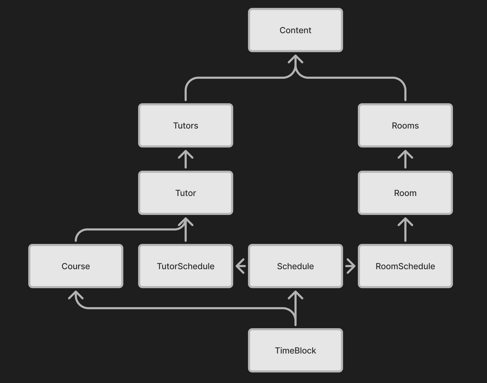

# Auto Scheduler Dev Docs

These docs explain the design of the scheduler. For actual API documentation, refer to the intellisense comments provided for functions.

## Brief Overview

This tool is a single webpage that has no server component, everything is handled on the client. It's built without a framework, so everything is custom. You will first need node installed. Run `npm install` to get this project's dependencies, and then run `npm run dev` to start a local instance of the website.

The most important class is `TimeBlock`. It's purpose is to represent any sort of time commitment. `TimeBlock`s are organized with `Schedule`s, which contain times in a map, where the keys are `Days`. `Days` is an enum of strings that are just day names. There are 2 types of `Schedule`s, `TutorSchedule` and `RoomSchedule`. Each is for the two classes `Tutor` and `Room` respectively. Each of these classes has a singleton manager `Tutors` and `Rooms`. Finally, the `Content` class is used to display this data on the page.

This isn't the full dependency tree, but shows the rough structure that's followed. One of the biggest difficulties you'll likely face is dealing with the `Tutors` and `Rooms` singletons, and how they interact with `TimeBlock`s. The setter and getter methods on `TimeBlock` will reference these singletons to access data about the `Tutor`s, `Room`s, and `Course`s the time is associated with. This makes unit testing difficult, since any tests you make will likely require these to initialized. 

Each of the core data-holding classes will have a `getDiv()` method to create the actual HTML used to display that class.

- [**Editors**](editors.md)
- [**I/O**](io.md)
- [**Rooms**](rooms.md)
- [**Scheduling**](scheduling.md)
- [**TimeBlocks**](timeblocks.md)
- [**Tooling**](tooling.md)
- [**Tutors**](tutors.md)
- [**Utilities**](utils.md)